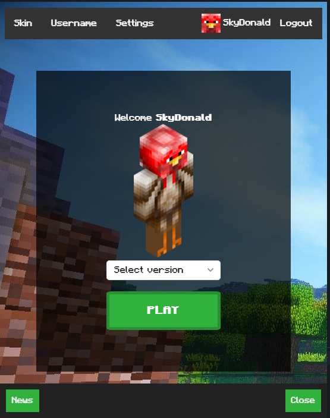

# SkyLauncher
A custom launcher for Minecraft

## Instructions
- Download the [latest release](https://github.com/SkyDonald/SkyLauncher/releases)
- Run the app and play Minecraft!

## Features
- Change Skin
- Change Username
- Automatically update Minecraft version
- Choose the version you want from 1.0 to latest release and snapshot
- Custom Status
- Custom Game Settings (RAM...)

### If your are on Linux or MacOS download the repo and type `npm run dist-linux` or `npm run dist-mac` then open SkyLauncher/dist and open the main file.

## Any problem?
You can contact us for support on our [chat server](https://discord.gg/AUfTUJA)

# Give me your opinion

## Exemple

